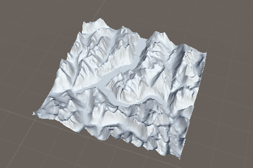
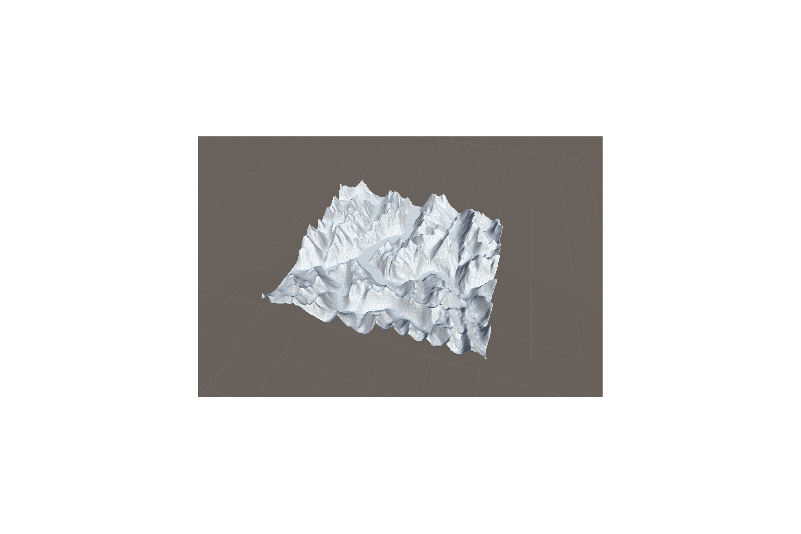
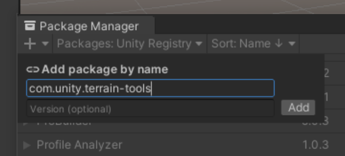
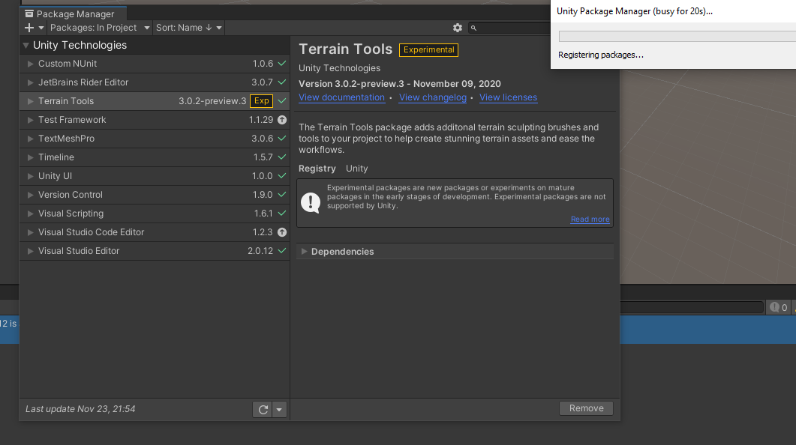
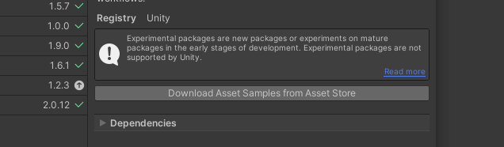

I built this terrain using Unity and Photoshop. It is a accurate model of the land using height maps and the new Terrauin Builder Tool in UniUnity

## First we need to install TERRAIN TOOLS
Im using Unity -v 2021.1

1. Open Package manager under `Window/Package manager`
2. Open the Plus icon dropdown to the Add package by name and type in `com.unity.terrain-tools`

3. You should now see the Terrain Tools added, soon as its loaded.

4. I also recomend adding the asset samples provided on the button link

5. Click import

Sweet lets play!

## Create new terrain
Right click select 3d object/Terrain
Boom

Or

Click on Window/Terrain/Terrain Toolbox
* this toolbox provides more customisability when you initially create the terrain.
* Pick your sizes and puck the `create` button.

## Get a terrain heightmap

* must be a square image!!!
* Edit in Photoshop to match the required image measurements size etc.

## Upload heightmap to Unity

If all goes well and you followed the correct measurements.
This might take a while (i got stuck on this for days because i wasnt making my image square, you've been warned)

